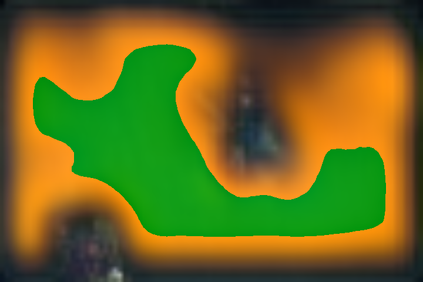

# Key Frame Interpolation Using Deep Learning

In this project I attempted to create a system that will take in as input two key frames of an animation and return an interpolation of them.  I used deep learning to fine-tune a pretrained fully convolutional neural network with a resnet50 backbone.  The network would take in a 6-channel image (the first three for the first frame and the latter three for the second frame) and it got as output a 3-channel image which represents the frame directly between the two frames.  I trained this network on half of the keyframes found in the movie "Kiki's Delivery Service" and then evaluated on the other half of the keyframes.  The network trained for 100 epochs with the training loss continually dropping and the validation loss plateuing at around the 62nd epoch.

## Install Dependencies
Installing the dependencies can be done with pip:
```
pip install -r requirements
```

## Usage

### Prediction
To simply run a prediction, you will need to download the networks weights available here: [000062.pth](https://byu.box.com/s/g0ahmyeu3n31upra1u8yxh5yan0ertml) and run the following command:
```
python infer.py <path/to/frame1> <path/to/frame2> <path/to/weights>
```
for example:
```
python infer.py samples/000000a.png samples/000000b.png checkpoints/000062.pth
```
this will output a file to the same name as the first frame but replacing the last five characters with `-out.png` for the above example, it will be `samples/000000-out.png`

### Generating Data
To generate the data, you will need a legal copy of a movie and then run the data.py script on a given movie:
```
python data.py <path/to/movie>
```
This will make a directory of files named in order of it being found int he movie with an 'a' file, a 'b' file and a 'y' file where 'a' is the first frame, 'b' is the second frame, and 'y' is the ground truth.

### Training
Once the data is generated, you can train the network on it by running `train.py` for example:
```
python train.py --device=<gpu number>
```
training on the gpu made it so that running 100 epochs took roughly 2 hours.  Every epoch that the model improves the training loss, it will save the weights as a file in checkpoints.

### Evaluation
You can evaluate the model and decide which saved checkpoint is the best to use by running the `evaluate.py` file.  For example:
```
python evaluate.py --device=<num of gpu>
```
This will go through the checkpoints directory and select the set of weights that produced the best evaluation loss.

## Results
I trained with two frames as the input to the network with a single frame as the output that is compared to an actual frame from the movie using a mean squared error.  Here is an example of the data I used:

Input Frame 1:

Input Frame 2:

Ground Truth Frame:

The network's actual output:


The results are far from desirable but there are some things of note.  The static backgrounds get carried through the network and are pretty well---albeit pretty blurry---recreated on the other side.

Most of the utter fail cases included dark scenes where the network didn't know what to do at all giving us this kind of interpolation:


## Future Work
Due to time and resource constraints, the results ended up being pretty terrible so in the future, I'd like to revisit this problem and try a couple new things.  The first is that I would explore different network architectures.  FCNs are pretty old and other fully convolutional type networks have emerged since.  Another is to explore the possiblity of using either LSTMs or Attention mechinisms where sequential data is the main focus.  In these frameworks I would use the first frame to predict subsequent frames with an ad hoc heuristic of the fact that the frames would move towards a final frame.  This would also allow for being able to predict all the frames between the key frames instead of just a single one like I am doing currently.


